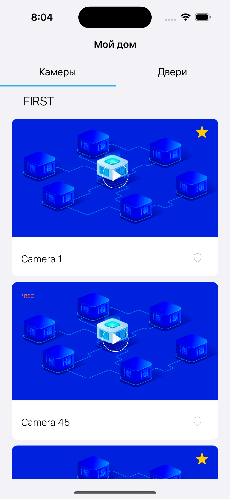
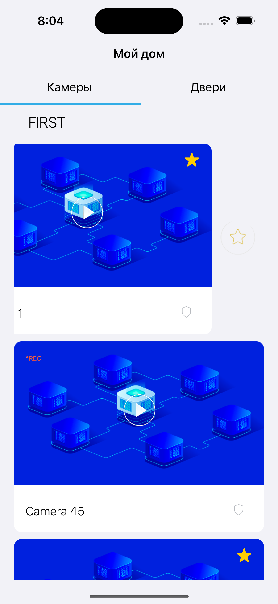
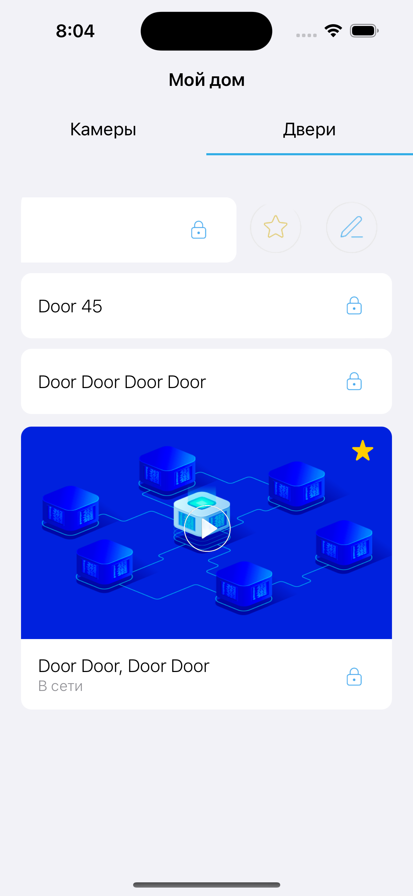
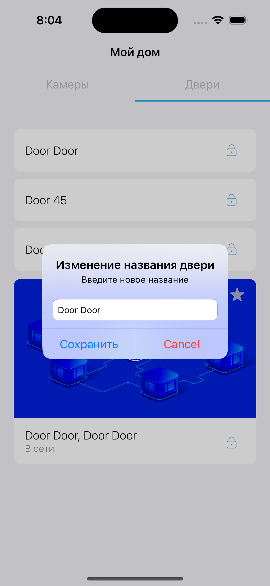
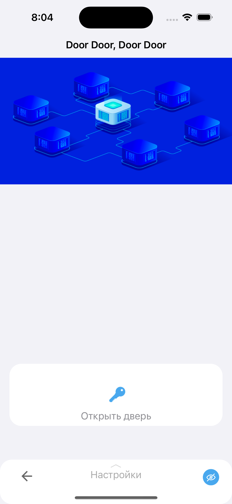

# MyHouse

Это iOS приложение, которое отображает камеры в комнатах дома и на дверях.

# Интерфейс
Приложение отображает камеры в доме, имеет функционал добавления/удаления камер и дверей в избранное.
Также имеет функционал редактирования названия дверей.

Основные классы:

1. ContainerViewController, который представляет TableViewController, в зависимости от выбранной вкладки.
 

2. CamerasTableViewController, отображающий камеры в доме. Если данных в базе Realm нет, то данные грузятся из сети и сохраняются в Realm. При свейпе экран вниз происходит загрузка и обновление данных из сети. Имеет функционал добавления/удаления камеры в избранное. 

3. DoorsTableViewController, отображающий камеры у дверей. Если данных в базе Realm нет, то данные грузятся из сети и сохраняются в Realm. При свейпе экран вниз происходит загрузка и обновление данных из сети. Имеет функционал добавления/удаления камеры в избранное и редактирования названия камеры.
 

4. DescriptionViewController, отображает информацию о камере у двери.

# Дополнение к установка проекта
1. Установить [CocoaPods](https://guides.cocoapods.org/using/getting-started.html)
2. Открыть деррикторию проекта в терминале и вызвать комманду `pod install`
3. В папке проекта открыть файл `*.xcworkspace`

# Используемый стек технологий
- Язык программирования - `Swift`
- Интерфейс - `UIKit`
- Архитектура - `MVС`
- Верстка интерфейса - `StoreyBoard`
- Frameworks: `Realm`
- iOS 13+
